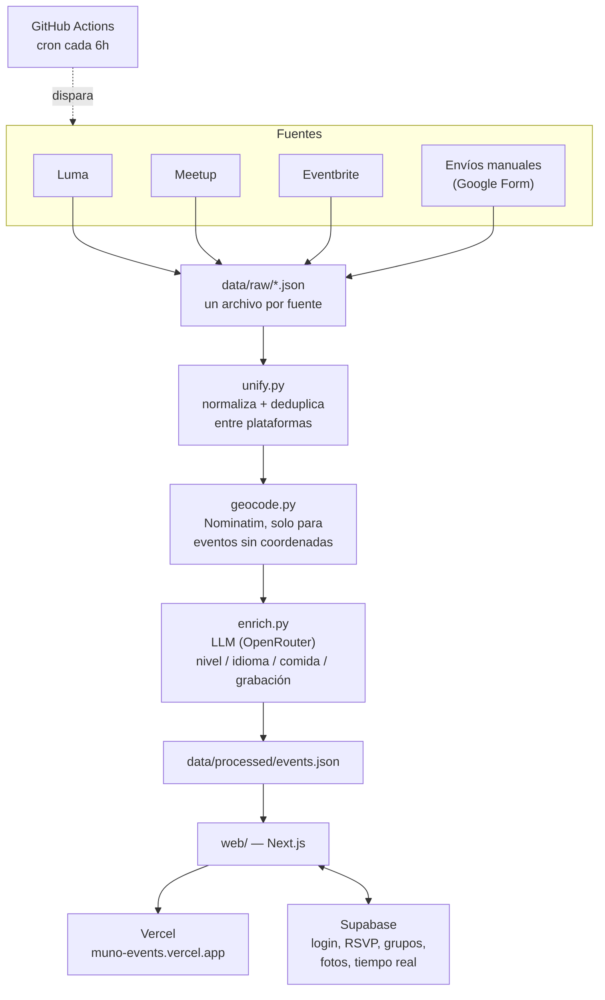

# muno — eventos de tech, IA y ML en Madrid

**[muno-events.vercel.app](https://muno-events.vercel.app)**

Todo el tech de Madrid en un sitio. Lo demás es ruido.

## Qué es esto

Madrid tiene cientos de meetups, charlas y hackathons de tech cada mes, pero repartidos
en Luma, Meetup, Eventbrite y grupos de WhatsApp/Telegram que nadie sigue de verdad. Si
quieres saber "qué hay esta semana" tienes que mirar cuatro sitios distintos, y aun así
te vas a encontrar el mismo evento publicado dos veces con nombres ligeramente distintos.

muno junta esas fuentes en un solo sitio, deduplica lo que está publicado en más de una
plataforma a la vez, y le añade una capa social (quién va, con quién vas, qué tal
estuvo) que ninguna de las plataformas originales te da.

## Cómo funciona (el esquema)



En corto: cuatro scrapers en Python van a buscar eventos cada 6 horas, un pipeline los
limpia y los une en un único archivo JSON, y una web en Next.js lee ese archivo y le
añade todo lo que hace falta iniciar sesión para usar (apuntarte, grupos, fotos después
del evento...), que vive en Supabase.

## Estructura del repo

```
.
├── src/eventos_tech_madrid/
│   ├── scrapers/           # uno por fuente: luma.py, meetup.py, eventbrite.py, manual.py
│   └── pipeline/           # unify.py, geocode.py, enrich.py
├── data/
│   ├── raw/                 # un JSON por fuente, tal cual sale del scraper
│   └── processed/           # events.json final — lo único que lee la web
├── web/                      # frontend Next.js + Supabase
│   ├── app/                  # páginas, componentes, lógica de cliente
│   └── supabase_schema.sql  # esquema completo de la base de datos
└── .github/workflows/scrape.yml   # cron que ejecuta todo el pipeline
```

## El pipeline de datos, paso a paso

1. **Los 4 scrapers** (`src/eventos_tech_madrid/scrapers/`) van cada uno a su fuente y
   escriben un JSON en `data/raw/`. Cada uno habla el idioma de su plataforma: Luma da
   coordenadas propias, Meetup no; Eventbrite solo da fecha sin hora; los envíos
   manuales vienen de las respuestas de un Google Form publicado como CSV.
2. **`unify.py`** normaliza los cuatro formatos distintos a un único esquema común, y
   **deduplica entre plataformas**: si el mismo evento está publicado en Luma y en
   Eventbrite a la vez (pasa más de lo que parece), se queda como un único evento con
   ambas fuentes anotadas, no como dos filas repetidas.
3. **`geocode.py`** rellena las coordenadas que faltan (Meetup no las da) usando
   Nominatim, el geocodificador gratuito de OpenStreetMap, y las cachea para no volver
   a pedir la misma dirección dos veces.
4. **`enrich.py`** pasa cada evento por un LLM gratuito (vía OpenRouter) para sacar
   cuatro datos que ninguna plataforma da de serie: nivel (principiante/intermedio/
   avanzado), idioma, si hay comida o bebida, y si el evento se graba.
5. El resultado final es **`data/processed/events.json`** — el único archivo que lee la
   web. Si algo va mal en cualquier paso, el paso siguiente sigue funcionando con lo que
   ya había del día anterior en vez de dejar la web sin datos.

## Cómo ejecutarlo en local

### El pipeline (Python)

Usa [uv](https://docs.astral.sh/uv/) para gestionar el entorno y las dependencias.

```bash
uv sync

# cada scraper se puede correr suelto — escribe en data/raw/
uv run python src/eventos_tech_madrid/scrapers/luma.py
uv run python src/eventos_tech_madrid/scrapers/meetup.py
uv run python src/eventos_tech_madrid/scrapers/eventbrite.py
uv run python src/eventos_tech_madrid/scrapers/manual.py

# geocodificar direcciones que falten
uv run python src/eventos_tech_madrid/pipeline/geocode.py

# unir todo en data/processed/events.json
uv run python src/eventos_tech_madrid/pipeline/unify.py

# opcional: enriquecer con el LLM (necesita OPENROUTER_API_KEY)
OPENROUTER_API_KEY=tu-clave uv run python src/eventos_tech_madrid/pipeline/enrich.py
```

El paso de `enrich.py` es opcional en local: si no tienes clave, sáltatelo — la web
funciona igual sin esos datos, solo no se muestran los filtros de nivel/idioma.

### La web (Next.js)

```bash
cd web
npm install
npm run dev
```

Necesita un archivo `web/.env.local` con las credenciales de un proyecto de Supabase:

```
NEXT_PUBLIC_SUPABASE_URL=https://tu-proyecto.supabase.co
NEXT_PUBLIC_SUPABASE_PUBLISHABLE_KEY=sb_publishable_...
```

Y esa base de datos tiene que tener el esquema de `web/supabase_schema.sql` cargado
(se pega entero en el SQL Editor de Supabase — no hay migraciones automáticas, cada
cambio de esquema se aplica a mano).

## La capa social (Supabase)

Esto es lo que diferencia muno de mirar directamente Luma o Meetup:

- **Entrar con GitHub** — sin contraseñas propias que gestionar.
- **"Voy"** — te apuntas a un evento en muno (no en la plataforma original); si la
  fuente dice que ya no quedan plazas, no te deja marcarlo. Se guarda una copia de
  los datos del evento en el momento de apuntarte, porque el pipeline solo conserva
  eventos futuros — en cuanto un evento pasa, desaparece de `events.json`, y sin esa
  copia "Mis eventos" no podría mostrar nada de lo pasado.
- **Mostrar u ocultar tu nombre** — apuntado por defecto en privado; lo activas tú si
  quieres que se vea quién más va.
- **Grupos** — creas uno, invitas por link, y cualquiera del grupo puede marcar "vamos"
  para todos a la vez. Cada grupo tiene su propia agenda compartida.
- **"¿Con quién coincidiste?"** — después de un evento, marcas con quién te cruzaste;
  solo se revela el contacto (GitHub, y LinkedIn si lo puso) si la otra persona también
  te marcó a ti. Nunca se entera nadie de un interés que no es mutuo.
- **Fotos, notas, documentos y vídeos** — cualquiera que fue a un evento puede dejar
  contenido después, visible solo para quien también fue.
- **Tiempo real** — si alguien se apunta mientras tienes la página abierta, el contador
  se actualiza solo, sin recargar.

Todo esto vive en Postgres con Row Level Security: las reglas de quién puede ver o
tocar qué fila están en la base de datos, no solo en el código de la web.

## Automatización (GitHub Actions)

`.github/workflows/scrape.yml` corre el pipeline entero cada 6 horas. Cada scraper
tiene `continue-on-error: true`: si uno falla (una plataforma cambia su web, bloquea
IPs, lo que sea), los demás siguen corriendo igualmente. Solo se hace commit si algo
cambió de verdad en `data/` — no se generan commits vacíos cada 6 horas porque sí.

Necesita un secreto `OPENROUTER_API_KEY` configurado en el repo (Settings → Secrets and
variables → Actions) para el paso de enriquecimiento con LLM.

## Despliegue

- **Web**: desplegada en Vercel con Root Directory = `web` y las mismas dos variables
  de entorno de arriba (`NEXT_PUBLIC_SUPABASE_URL` / `NEXT_PUBLIC_SUPABASE_PUBLISHABLE_KEY`).
- **Login con GitHub**: hace falta una GitHub OAuth App cuya callback URL apunte a
  `https://<tu-proyecto>.supabase.co/auth/v1/callback`, configurada como proveedor en
  Supabase Auth.
- **Datos**: se actualizan solos cada 6h vía el cron de arriba — no hace falta
  redesplegar nada a mano para que aparezcan eventos nuevos.

## Qué le falta

- **Newsletter semanal** — pendiente de tener un dominio propio para poder enviar
  correos de verdad (no solo pruebas) desde un servicio como Resend.
- **Matching antes del evento** — avisar si alguien que te interesa también va a un
  evento futuro, no solo después de haber coincidido ya una vez.
