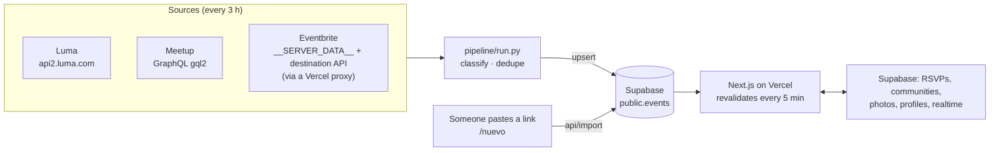

# muno: tech, AI and startup events in Madrid

**[muno-events.vercel.app](https://muno-events.vercel.app)**

Every tech meetup, conference, hackathon, workshop and networking event in Madrid, in one place.
On top of that there is a social layer: sign up with your people, see who is going, and share
photos after the event. (The app itself is in Spanish.)

## How it works


```mermaid
flowchart LR
    subgraph sources["Sources (every 3 h)"]
        luma["Luma<br/>api2.luma.com"]
        meetup["Meetup<br/>GraphQL gql2"]
        eb["Eventbrite<br/>__SERVER_DATA__ + destination API<br/>(via a Vercel proxy)"]
    end
    sources --> run["pipeline/run.py<br/>classify · dedupe"]
    run -->|upsert| db[(Supabase<br/>public.events)]
    user["Someone pastes a link<br/>/nuevo"] -->|api/import| db
    db --> web["Next.js on Vercel<br/>revalidates every 5 min"]
    web <--> social["Supabase: RSVPs, communities,<br/>photos, profiles, realtime"]
```

### Data (`src/eventos_tech_madrid/`)

| File | What it does |
|---|---|
| `sources.py` | **The list of sources.** To follow a new Meetup group or Luma calendar, add one line here. |
| `scrapers/luma.py` | Uses luma.com's internal (public, paginated) API. Searches by category around Madrid and reads community calendars. |
| `scrapers/meetup.py` | Uses meetup.com's GraphQL endpoint: keyword searches plus about 60 Madrid tech groups. |
| `scrapers/eventbrite.py` | Reads the search result pages, then asks for ticket availability of each event. |
| `pipeline/classify.py` | Rule-based classifier: is it tech, what kind of event (meetup, conference, hackathon, networking, workshop, talk), its topics and language. |
| `pipeline/run.py` | Glues everything together: dedupes across platforms, collapses recurring series, upserts into Supabase. |

**Availability.** Each platform reports it differently, so it is normalised into a single status
that is what people see on the site: `open`, `few_left`, `waitlist`, `sold_out`, `closed` or
`cancelled`.

- Luma: `registration_availability`, `ticket_info.is_sold_out`, `spots_remaining` and `waitlist_status`.
- Meetup: `maxTickets` versus attendees, number of people on the waitlist, and `rsvpsClosed`.
- Eventbrite: `ticket_availability.is_sold_out`, `has_available_tickets` and `waitlist_available`.

**Eventbrite and GitHub Actions.** Eventbrite blocks GitHub's IP addresses (HTTP 405). The scraper
therefore asks `web/app/api/eventbrite-proxy`, which downloads the pages from Vercel. The route
only allows Eventbrite search and availability URLs, and only with the shared secret
`SCRAPER_PROXY_SECRET`. Open `/api/eventbrite-proxy?check=1` to test that Vercel can still reach Eventbrite.

**Failures are loud.** If a source fails, the GitHub job fails and you get an email; the other
sources are still saved. A blocked Eventbrite shows up as a warning instead. Every run is logged
in the `scrape_runs` table.

### Web (`web/`)

| Route | What is there |
|---|---|
| `/` | Discover: search, filters (today, this week, weekend, free, spots left, type, topic), list or map view, and "most popular this week". |
| `/e/[id]` | Event page: availability, a button to register on the original platform, "Going" / "Interested", go with your community, who is going and, once it is over, photos. |
| `/nuevo` | Paste a link (Luma, Meetup, Eventbrite, LinkedIn or any website) and the form fills itself in. |
| `/comunidades` | Private (invite link) or open communities, each with its own agenda and history. |
| `/planes` | Your upcoming events and the ones you attended, where you can upload photos. |
| `/perfil` | Name, what you do, LinkedIn, and whether your name is shown to other attendees. |
| `/privacidad`, `/terminos` | Privacy policy and terms (required by Google for the sign-in consent screen). |

Sign-in: Google (official Google Identity Services button, so the user sees muno and not the
Supabase domain), GitHub, and email magic link.

## Setup (one time)

1. **Database.** In Supabase, open the SQL Editor and run, in order,
   `supabase/migrations/001_schema_inicial.sql`, `002_events_y_comunidades.sql` and
   `003_permisos_scraper.sql`. The project has "Automatically expose new tables" turned off, so
   the grants in each file are required.
2. **GitHub secrets** (Settings → Secrets and variables → Actions):
   - `SUPABASE_URL`: your project URL.
   - `SUPABASE_SERVICE_ROLE_KEY`: the Supabase **secret key** (Project Settings → API Keys).
     It must never go in the web app or in the code.
   - `SCRAPER_PROXY_SECRET`: a long random string (`openssl rand -hex 32`).
3. **Vercel environment variables:** `NEXT_PUBLIC_SUPABASE_URL`, `NEXT_PUBLIC_SUPABASE_PUBLISHABLE_KEY`
   and the same `SCRAPER_PROXY_SECRET` as in GitHub.
4. **Sign-in** (Supabase → Authentication):
   - **Google**: create an OAuth client in Google Cloud Console (type "Web application").
     Authorized JavaScript origins: your site URL and `http://localhost:3000`. Redirect URI:
     `https://<project>.supabase.co/auth/v1/callback`. Paste the client ID and secret into
     Supabase → Sign In / Providers → Google, and publish the consent screen.
   - **GitHub** and **Email** are enabled in the same place.
   - **URL Configuration**: set the Site URL and add `https://<your-site>/**` and
     `http://localhost:3000/**` to the Redirect URLs.
   - **Emails**: the built-in sender only allows 2 emails per hour, so configure custom SMTP
     (Authentication → Emails → SMTP Settings) and paste the HTML from `supabase/templates/`
     into the "Confirm signup" and "Magic Link" templates.
5. Run the workflow once by hand (Actions → Scrape eventos → Run workflow) to fill the table.

## Running locally

```bash
uv sync
uv run muno-scrape --dry-run        # scrape without writing; leaves data/latest.json
uv run muno-scrape --only meetup    # a single source (needs SUPABASE_* in the environment)

cd web && npm install && npm run dev
```

`web/.env.local` needs `NEXT_PUBLIC_SUPABASE_URL` and `NEXT_PUBLIC_SUPABASE_PUBLISHABLE_KEY`.
Under `next dev`, if the `events` table does not exist yet the site falls back to `data/latest.json`.
Local credentials live in `secrets/`, which is git-ignored.

## Next steps

- More sources: AI Tinkerers (madrid.aitinkerers.org), Campus Madrid and South Summit agendas.
  Each one is a new scraper in `scrapers/`.
- Notifications: "someone from your community is going to X" and "a spot just opened up" (email or push).
- Weekly email digest.
- More cities: `CITY` in `sources.py` and the `city` column are already in place.
