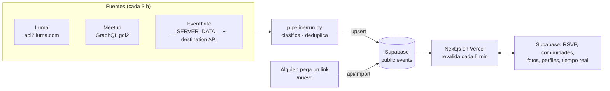

# muno: eventos de tech, IA y startups en Madrid

**[muno-events.vercel.app](https://muno-events.vercel.app)**

Todos los meetups, conferencias, hackathons, workshops y eventos de networking de tech en
Madrid, juntos en un solo sitio. Además tiene una capa social: te apuntas con tu gente, ves
quién va y después del evento subís las fotos.

## Cómo funciona


```mermaid
flowchart LR
    subgraph fuentes["Fuentes (cada 3 h)"]
        luma["Luma<br/>api2.luma.com"]
        meetup["Meetup<br/>GraphQL gql2"]
        eb["Eventbrite<br/>__SERVER_DATA__ + destination API"]
    end
    fuentes --> run["pipeline/run.py<br/>clasifica · deduplica"]
    run -->|upsert| db[(Supabase<br/>public.events)]
    user["Alguien pega un link<br/>/nuevo"] -->|api/import| db
    db --> web["Next.js en Vercel<br/>revalida cada 5 min"]
    web <--> social["Supabase: RSVP, comunidades,<br/>fotos, perfiles, tiempo real"]
```

### Datos (`src/eventos_tech_madrid/`)

| Archivo | Qué hace |
|---|---|
| `sources.py` | **La lista de fuentes.** Para añadir una comunidad de Meetup o un calendario de Luma, añade una línea aquí. |
| `scrapers/luma.py` | Usa la API interna de luma.com (pública, paginada). Busca por categoría alrededor de Madrid y en los calendarios de las comunidades. |
| `scrapers/meetup.py` | Usa el GraphQL de meetup.com: búsquedas por palabra clave y unos 60 grupos tech de Madrid. |
| `scrapers/eventbrite.py` | Lee las páginas de búsqueda y luego pide la disponibilidad de entradas de cada evento. |
| `pipeline/classify.py` | Decide si un evento es tech, de qué tipo es (meetup, conferencia, hackathon, networking, workshop o charla), sus temas y su idioma. |
| `pipeline/run.py` | Lo junta todo, deduplica entre plataformas, agrupa las series que se repiten y guarda en Supabase. |

**Estado de plazas.** Cada plataforma lo cuenta a su manera, así que se traduce a un único
estado que es lo que ve la gente en la web: `open` (hay plazas), `few_left` (quedan pocas),
`waitlist` (lista de espera), `sold_out` (agotado), `closed` (inscripción cerrada) o `cancelled`.

- Luma: `registration_availability`, `ticket_info.is_sold_out`, `spots_remaining` y `waitlist_status`.
- Meetup: `maxTickets` frente a apuntados, número de personas en lista de espera y `rsvpsClosed`.
- Eventbrite: `ticket_availability.is_sold_out`, `has_available_tickets` y `waitlist_available`.

Si una fuente falla, el job de GitHub **falla de verdad** y te llega un email. Las demás
fuentes se guardan igualmente. Cada ejecución queda registrada en la tabla `scrape_runs`.

### Web (`web/`)

| Ruta | Qué hay |
|---|---|
| `/` | Descubrir: buscador, filtros (hoy, esta semana, finde, gratis, con plazas, tipo, tema), lista o mapa y "Lo más top". |
| `/e/[id]` | Evento: estado de plazas, botón para apuntarse en la plataforma original, "Voy" / "Me interesa", ir con tu comunidad, quién va y, cuando ya ha pasado, las fotos. |
| `/nuevo` | Pegas un link (Luma, Meetup, Eventbrite, LinkedIn o cualquier web) y el formulario se rellena solo. |
| `/comunidades` | Comunidades privadas (con link de invitación) o abiertas. Cada una tiene su agenda y su historial. |
| `/planes` | Tus próximos eventos y los eventos a los que fuiste, donde puedes subir fotos. |
| `/perfil` | Nombre, a qué te dedicas, LinkedIn y si se muestra tu nombre a los demás. |

## Puesta en marcha (una sola vez)

1. **Base de datos.** En Supabase, abre el SQL Editor, pega
   `supabase/migrations/002_events_y_comunidades.sql` y ejecútalo (el 001 ya está aplicado).
2. **Secretos de GitHub** (Settings → Secrets and variables → Actions):
   - `SUPABASE_URL` = `https://tnqncbjkrvyytfasnagd.supabase.co`
   - `SUPABASE_SERVICE_ROLE_KEY` = la **secret key** de Supabase (Project Settings → API keys).
     Esta nunca va en la web ni en el código.
   - Puedes borrar `OPENROUTER_API_KEY`, ya no se usa.
3. **Login** (Supabase → Authentication → Sign In / Providers):
   - **Google**: crea un OAuth client en Google Cloud Console. Redirect URI:
     `https://tnqncbjkrvyytfasnagd.supabase.co/auth/v1/callback`.
   - **Email**: ya viene activado (magic link).
   - **GitHub**: ya lo tenías.
   - En URL Configuration, añade `https://muno-events.vercel.app/**` y `http://localhost:3000/**`
     a Redirect URLs.
4. Lanza el workflow a mano una vez (Actions → Scrape eventos → Run workflow) para llenar la tabla.

## En local

```bash
uv sync
uv run muno-scrape --dry-run        # scrapea sin escribir; deja data/latest.json
uv run muno-scrape --only meetup    # una sola fuente (necesita SUPABASE_* en el entorno)

cd web && npm install && npm run dev
```

`web/.env.local` necesita `NEXT_PUBLIC_SUPABASE_URL` y `NEXT_PUBLIC_SUPABASE_PUBLISHABLE_KEY`.
En `next dev`, si la tabla `events` aún no existe, la web usa `data/latest.json`.

## Siguientes pasos

- Más fuentes: AI Tinkerers (madrid.aitinkerers.org), la agenda de Campus Madrid y la de
  South Summit. Se añaden como nuevos scrapers en `scrapers/`.
- Avisos: "alguien de tu comunidad va a X" y "se ha liberado una plaza" (por email o push).
- Más ciudades: `CITY` en `sources.py` y la columna `city` ya están preparadas.
